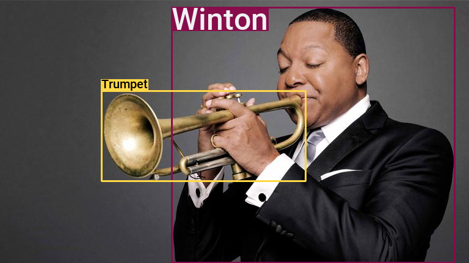
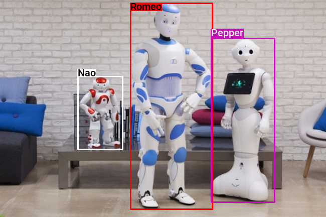
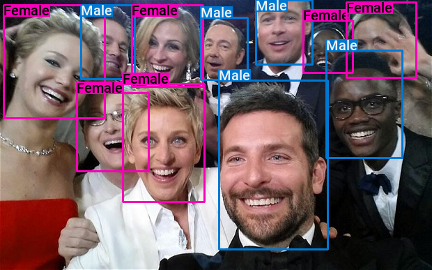
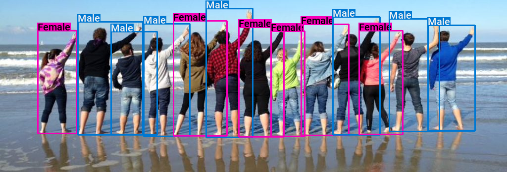

# Bounding Box
**Bounding Box** is a library to plot pretty bounding boxes with a simple Python API.

*Please notice this lib does **not** do object detection for you, but only helps to display pretty bounding boxes with a carefully chosen set of colors.*

<table>
<tr>
  <td>Latest Release</td>
  <td>
    <a href="https://pypi.org/project/bounding-box/">
    
    </a>
  </td>
</tr>
<tr>
  <td>License</td>
  <td>
    <a href="https://github.com/nalepae/bounding-box/blob/master/LICENSE">
    
    </a>
  </td>
</tr>
</table>
**WARNING:** Version 1.0 of this library is not yet released. API breaking changes could still occur! 

Please see below some examples of bounding boxes plotted with this library.

<p align="center">
  
  
  
  
  
  
  
  
</p>


## Installation
`$ pip install bounding-box [--user]`

## API
First, you have to import `bounding_box`:
```python
from bounding_box import bounding_box as bb
```

Then, just add the bounding box on an image.
 ```python
bb.add(image, left, top, right, bottom, label, color)
 ```

This method takes 5 mandatory parameters:
- `image`: A numpy array, channel last (ie. height x width x colors) with
channels in **BGR** order (same as **openCV** format).
- `left`: A integer representing the left side of the bounding box.
- `top`: A integer representing the top side of the bounding box.
- `right`: A integer representing the right side of the bounding box.
- `bottom`: A integer representing the bottom side of the bounding box.

This method takes also 2 optional parameters:
- `label`: A string representing the label of the bounding box.
If not specified, then no label is displayed.
- `color`: A string representing the color of the bounding box.
Possible values are: `navy`, `blue`, `aqua`, `teal`, `olive`, `green`,
`lime`, `yellow`, `orange`, `red`, `maroon`, `fuchsia`, `purple`,
`black`, `gray` ,`silver`.
If `label` is specified and `color` is not, then a color depending
on the `label` is randomly chosen.
If neither `color` and `label` is specified then the bounding box
color is defaulted to `green`.

## Examples
The script to plot exemples of this **README** is available
[here](https://github.com/nalepae/bounding-box/blob/master/docs/examples.py).

To run it, go in top level of this git repository then write:
 ```bash
python docs/examples.py
 ```

If you run `examples.py` in an other directory it won't work.
