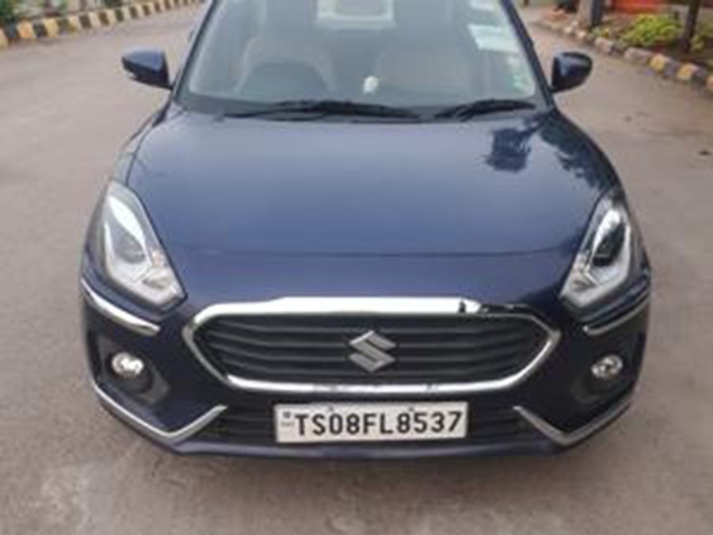
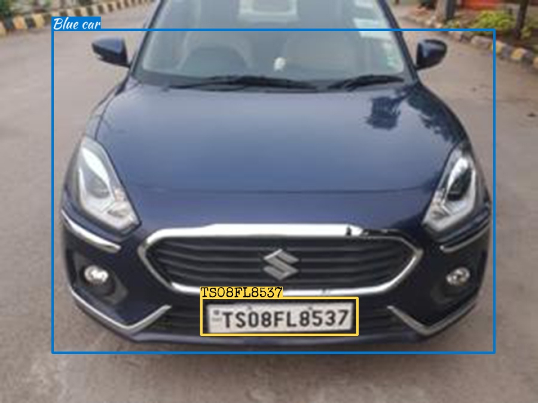

### Imbo image custom rescaling

The rescaling method is helpful when you need to resize image and their corresponding bounding boxes to some different dimension.

Similarly if very small resolution image is passed, resize them to larger dimension on step 1.

````bash
python rescale_padding.py
````

<table>
    <h3>Original Image</h3>
    
    <hr>
    <h3>imbo.rescale(....)</h3>
    
</table>


